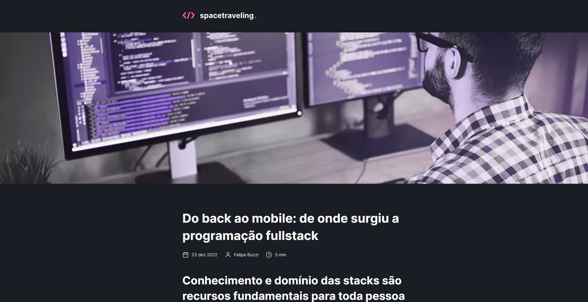
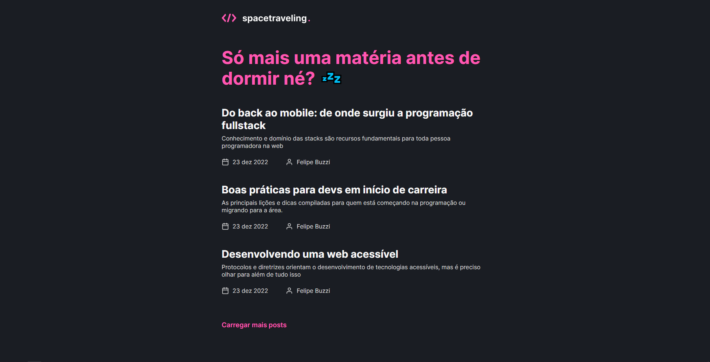
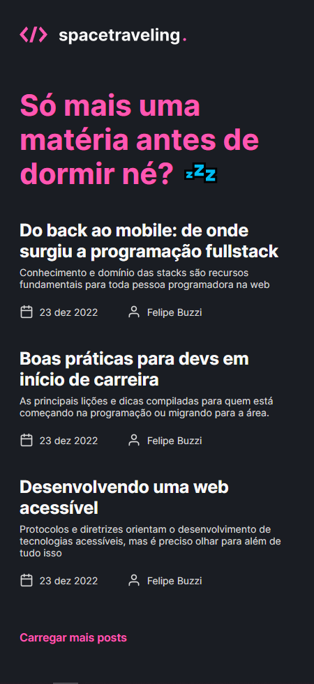

<h3 align="center">
  <div align="center">
    
  </div>
  <br><br>
  <b>A NEXT.JS blog with Prismic CMS.</b>
  <br>
</h3>

# Index

- [About](#about)
- [Functionalities](#functionalities)
- [Technologies](#technologies)
- [How to use](#how-to-use)

<a id="about"></a>

## :bookmark: About

Static Site Generation have a lot of use-cases, but what better example than a blog? spacetraveling it's a blog developed in NEXT.JS using SSG to pre-load every blog page, so the navigation can be as fluid as possible.

<div align="center">
    
</div>

## :zap: Try it yourself
[https://spacetraveling-blog.vercel.app/](https://spacetraveling-blog.vercel.app/)

<div align="center">
    
</div>

<a id="functionalities"></a>

## :fire: Functionalities

- ### **Blog**
  - Post listing.
  - Post pagination.
  - Post read-time calculation.
  - Post navigation inside post page.
  - Commenting on posts.
  - Github auth.

- ### **Prismic CMS**
  - Create posts with images, heading, text and links.
  - Preview posts before deploying to the website.

<br>

<div align="center">
    
</div>

<a id="technologies"></a>

## :rocket: Technologies

The project is made with:
- [React JS](https://reactjs.org/)
- [NextJS](https://nextjs.org/)
- [Prismic IO](https://prismic.io/)
- [TypeScript](https://www.typescriptlang.org/)

<a id="how-to-use"></a>

## :fire: How to Use

- ### **Dependencies**

  - Is **required** to install **[Node.js](https://nodejs.org/en/)**
  - In order to run scripts and install dependencies you need to install a **package manager**, like yarn.
  <br>

1. First step, clone this github repository:

```sh
  $ git clone https://github.com/lamongabriel/spacetraveling-blog.git
```
<br>

2. You must set a .env.local file with a Prismic IO configuration for using the preview function, to get your key you must create a [Prismic](https://prismic.io/) project. [Checkout the step-by-step](https://prismic.io/docs/preview-content-nextjs)
```bash
$ ACCESS_KEY=youkey
```
<br>

3. Running the project
```bash
$ yarn
$ yarn dev
```
